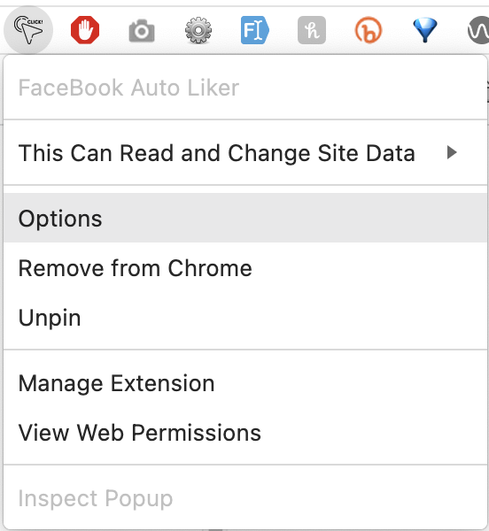
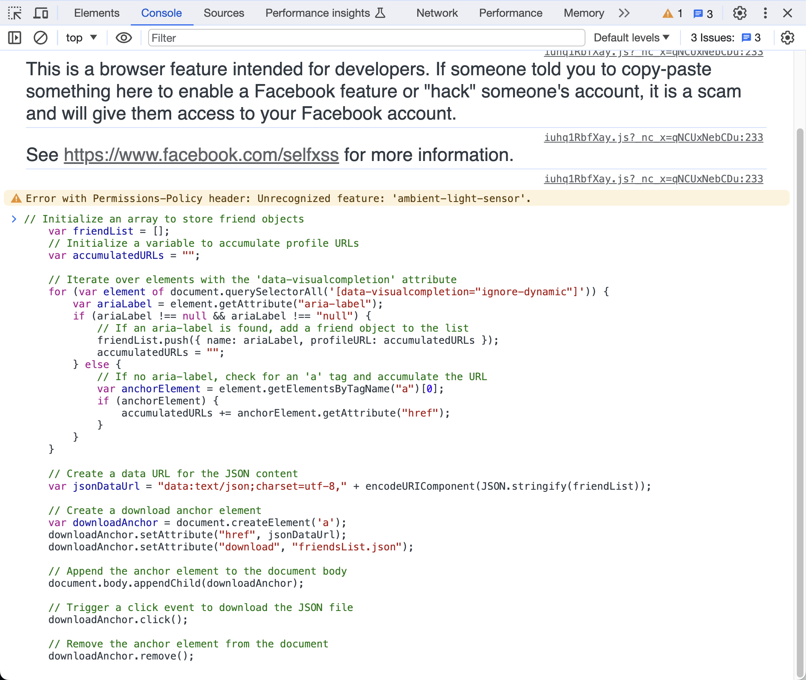
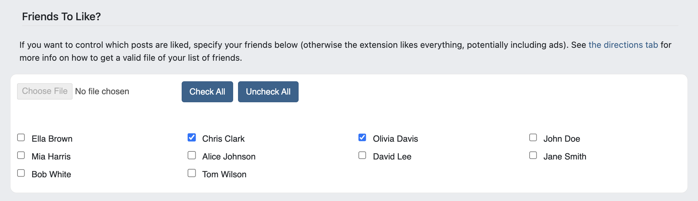

# FaceBook AutoLiker

This Chrome extension will automatically like your FB friends posts, based on settings you define (when to run, which friends to like, which blockwords to avoid, minimum likes, etc.). Once installed and activated (by clicking the extension's icon while viewing https://facebook.com), it will automatically refresh the current tab at a random interval you define and then automatically click the Like button.

To reach the options page for this extension, simply hover over the extension's icon, right-click it, and select "Options":

  

Extension Features
------------------

*   Only runs during specified hours
*   After a refresh occurs, support for an artificial delay before a click event is triggered
*   If multiple elements are matched, support for a delay (in milliseconds) between the first clicked item, and the second, and so on
*   Only click the like button when visible (ie, within the viewport), or not
*   Ability to like only certain friend’s posts (premium feature)
*   Ensure that the extension won’t like a post containing disallowed words (premium feature)
*   Only like posts with a minimum number of existing likes (premium feature)

  

Troubleshooting
---------------

Far and away the most common reason the extension stops working is because your computer goes to sleep. Therefore, you will likely want to install the free [Mouse Mover](https://apps.microsoft.com/store/detail/move-mouse/9NQ4QL59XLBF), [Mouse Jiggler](https://mouse-jiggler.en.uptodown.com/windows), or some similar piece of software to ensure your computer doesn't go to sleep (and thus stops clicking anything after a few minutes of inactivity).

  

How To Get A List of All Your Facebook Friends (premium feature)
----------------------------------------------------------------

**From Facebook:**

1.  Go to the friend list page: [https://www.facebook.com/friends/list](https://www.facebook.com/friends/list)
    
2.  Scroll all the way down to the bottom of the left sidebar (specifically the area displaying your friends) so that your entire friend list loads
    
3.  Press option + ⌘ + J (on macOS), or Shift + CTRL + J (on Windows/Linux) to open developer tools, then click on Console tab
    
4.  As shown in the image below the following code, paste in the following Javascript in the Console and press return to generate a .json file named friendsList.json with a list of all your friends:
    
         
            // Initialize an array to store friend objects
            var friendList = [];
            // Initialize a variable to accumulate profile URLs
            var accumulatedURLs = "";
            
            // Iterate over elements with the 'data-visualcompletion' attribute
            for (var element of document.querySelectorAll('[data-visualcompletion="ignore-dynamic"]')) {
                var ariaLabel = element.getAttribute("aria-label");
                if (ariaLabel !== null && ariaLabel !== "null") {
                    // If an aria-label is found, add a friend object to the list
                    friendList.push({ name: ariaLabel, profileURL: accumulatedURLs });
                    accumulatedURLs = "";
                } else {
                    // If no aria-label, check for an 'a' tag and accumulate the URL
                    var anchorElement = element.getElementsByTagName("a")[0];
                    if (anchorElement) {
                        accumulatedURLs += anchorElement.getAttribute("href");
                    }
                }
            }
            
            // Create a data URL for the JSON content
            var jsonDataUrl = "data:text/json;charset=utf-8," + encodeURIComponent(JSON.stringify(friendList));
            
            // Create a download anchor element
            var downloadAnchor = document.createElement('a');
            downloadAnchor.setAttribute("href", jsonDataUrl);
            downloadAnchor.setAttribute("download", "friendsList.json");
            
            // Append the anchor element to the document body
            document.body.appendChild(downloadAnchor);
            
            // Trigger a click event to download the JSON file
            downloadAnchor.click();
            
            // Remove the anchor element from the document
            downloadAnchor.remove();
            
        
    
    
    
5.  Click 'Choose File' within the 'Friends To Like?'' area of this plugin to select/upload your friends list
    

**Manually:**

If you don't mind the work, you may also use the following template and manually generate a .json file that you can then upload in the "Friends To Like?" section of the extension:

                                [
                                    {"name":"John Doe","profileURL":"https://www.facebook.com/johndoe123"},
                                    {"name":"Jane Smith","profileURL":"https://www.facebook.com/janesmith456"},
                                    {"name":"Alice Johnson","profileURL":"https://www.facebook.com/alicej"},
                                    {"name":"Bob White","profileURL":"https://www.facebook.com/bobwhite789"},
                                    {"name":"Ella Brown","profileURL":"https://www.facebook.com/ellabrownxyz"},
                                    {"name":"Tom Wilson","profileURL":"https://www.facebook.com/tomwilson1"},
                                    {"name":"Olivia Davis","profileURL":"https://www.facebook.com/oliviadavis22"},
                                    {"name":"Chris Clark","profileURL":"https://www.facebook.com/chrisclark333"},
                                    {"name":"Mia Harris","profileURL":"https://www.facebook.com/miaharris4"},
                                    {"name":"David Lee","profileURL":"https://www.facebook.com/davidlee789"}
                                ]
                            

When you have your json file, and once it's uploaded under General Settings, you should see a list of friends, like so:   
  

How To View Your Likes and Reactions to Check What the Extension is Clicking
----------------------------------------------------------------------------

*   Click your profile picture in the top right of Facebook.
*   Select Settings & Privacy, then click Activity Log.
*   Select Comments and Reactions in the left sidebar, then click Likes and Reactions

  

Donate To Improve This Software
-------------------------------

