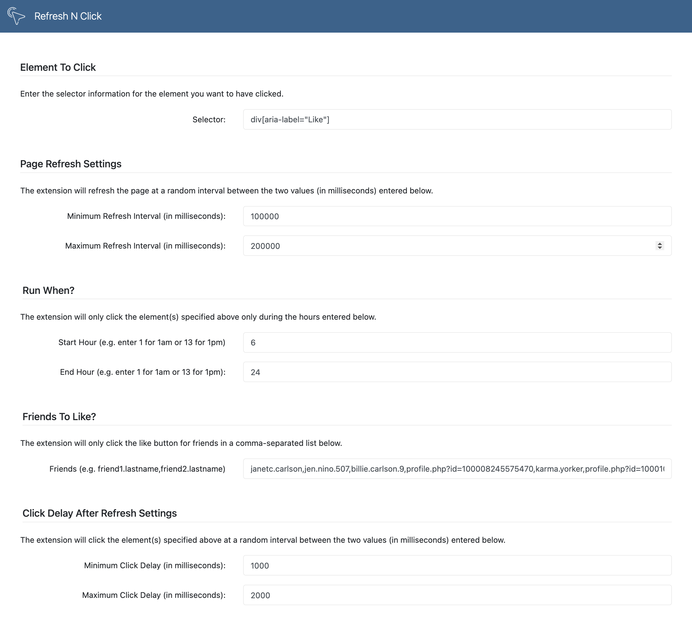

# FaceBook AutoLiker

This Chrome extension will automatically like your FaceBook friends posts.  Once installed and activated (by clicking the extension's icon while viewing any url), it will automatically refresh the current tab at a random interval you define and then automatically click the specified selector on the page (in this case, div[aria-label="Like"]).  You will likely want to install the free Mouse Jiggler (https://mouse-jiggler.en.uptodown.com/windows( or Mouse Mover (https://apps.microsoft.com/store/detail/move-mouse/9NQ4QL59XLBF) tools in order to ensure your computer doesn't go to sleep (and thus doesn't click anything after a few minutes of inactivity).

## Features

* Ability to like only certain friend’s posts
* Ensure that the extension won’t like a post containing disallowed words
* Only like posts with a minimum number of existing likes
* Only run during specified hours
* After a refresh occurs, support for an artificial delay before a click event is triggered
* If multiple elements are matched, support for a delay (in milliseconds) between the first clicked item, and the second, and so on

## Options Page Example


## How To Get A Comma-Delimited List of All Your Facebook Friends

1. Go to the friend list page:  [https://www.facebook.com/friends/list](https://www.facebook.com/friends/list)
2. Scroll all the way down so that your entire friend list loads
3. Press F12 to open developer tools, click on console tab
4. Paste in the following Javascript and press return: 
        
```javascript
        var exportObj = [];
        var accumulated = "";
        
        for (var el of document.querySelectorAll('[data-visualcompletion="ignore-dynamic"]')) {
        var name = el.getAttribute("aria-label");
        if (name !== null && name !== "null") {
            exportObj.push({ name: name, profileURL: accumulated });
            accumulated = "";
        } else {
            var a = el.getElementsByTagName("a")[0];
            if (a) {
                var href = a.getAttribute("href");
                
                if (href) {
                    // Remove "https://www.facebook.com/" from the href
                    href = href.replace(/^https:\/\/www.facebook.com\//, "");
                    accumulated += href;
                }
            }
          }
        }
        // Extract profileURL values and create a comma-delimited string
        var profileURLString = exportObj.map(obj => obj.profileURL).filter(url => url !== "").join(",");
        // Output the comma-delimited string
        console.log(profileURLString);
```
### Or, if you want to be able to also see your friend's names alongside their profile url, use this:

```javascript
var labelText = "";
for (var element of document.querySelectorAll('[data-visualcompletion="ignore-dynamic"]')) {
    var name = element.getAttribute("aria-label");
    if(name != null && name != "null"){
        labelText = "Name:"+name +", "+ labelText;
        console.log(labelText);
        labelText = "";
    }else{
        var a = element.getElementsByTagName("a")[0];
        if(a){
            labelText += "Profile URL: "+ a.getAttribute("href");
        }
    }
}
```

## How To View Your Likes and Reactions to check what the extension is clicking

1. Click your profile picture in the top right of Facebook.
2. Select Settings & Privacy, then click Activity Log.
3. Select Comments and Reactions in the left sidebar, then click Likes and Reactions
    
    
## Donate To Improve This Software
[](https://www.buymeacoffee.com/addasite)